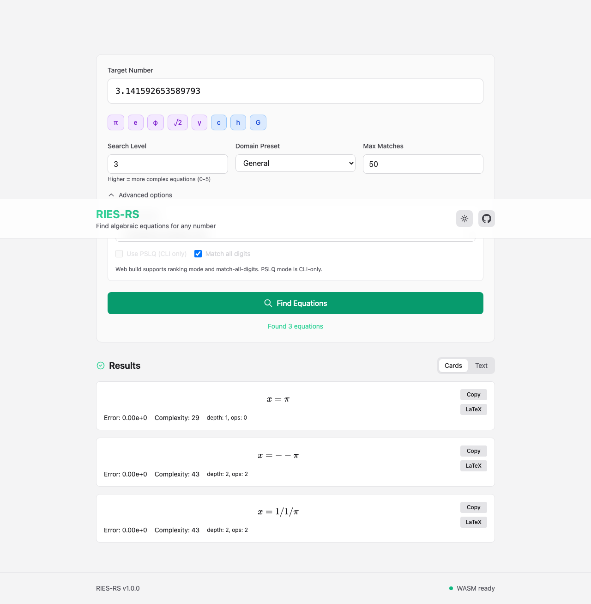

# ries-rs

[](https://github.com/maxwellsantoro/ries-rs/actions/workflows/ci.yml)
[](https://github.com/maxwellsantoro/ries-rs/actions/workflows/coverage.yml)
[](https://crates.io/crates/ries)
[](https://pypi.org/project/ries-rs/)
[](LICENSE)

`ries-rs` is a Rust implementation of Robert P. Munafo's RIES inverse equation
solver. Given a target number, it searches for algebraic equations that have
that number as a solution.

The historical acronym is RIES, for "RILYBOT Inverse Equation Solver". This
repository aims to be a modern, documented, reproducible reference
implementation rather than a historical clone.



## Install

### CLI

The crates.io package is named `ries`; the installed binary is `ries-rs`.

```bash
cargo install ries --locked
```

Prebuilt Linux, macOS, and Windows archives are attached to each
[GitHub release](https://github.com/maxwellsantoro/ries-rs/releases).

For unreleased development builds:

```bash
cargo install --git https://github.com/maxwellsantoro/ries-rs --locked

# Or, from a local checkout:
cargo install --path . --locked
```

### Python Bindings

```bash
pip install ries-rs
```

For local source development of the bindings:

```bash
pip install maturin
cd ries-py
maturin develop --release
```

### Web App / WASM

GitHub releases include a `ries-rs-wasm.tar.gz` artifact with the generated WASM
packages. To build the browser bundle locally:

```bash
npm run build:web:site
```

Deploy the contents of `dist/web-site/` to a path such as
`https://example.com/projects/ries-rs/`.

Detailed setup guides:

- [Python bindings](docs/PYTHON_BINDINGS.md)
- [WASM bindings](docs/WASM_BINDINGS.md)
- [Web UI hosting](web/README.md)

## Quick Start

Basic search:

```bash
ries-rs 3.141592653589793

# Example output:
#                    x = pi                       ('exact' match) {14}
#                  x-3 = 1/7                      for x = T + 1.26e-3 {24}
```

Classic-style output:

```bash
ries-rs --classic 2.5063
```

Deterministic machine-readable output:

```bash
ries-rs 3.141592653589793 --deterministic --json --emit-manifest run.json
```

For the authoritative option list:

```bash
ries-rs --help
```

## What v1.0 Delivers

Version 1.0 is scoped as a disciplined, modern reference implementation:

- Faithful reimplementation of the core RIES search model
- Deterministic and documented execution modes
- Memory-safe Rust implementation with optional parallel search
- Structured output for automation (`--json`, `--emit-manifest`)
- CLI, Rust library, Python bindings, and WebAssembly builds
- Modular presets, profiles, and extension points

Out of scope for v1.0:

- Symbolic AI or conjecture systems
- PSLQ research-platform ambitions beyond the shipped CLI mode
- Experimental search branches outside the core RIES model

## Why Use `ries-rs`

- Rust implementation with a cleaner architecture and broad regression coverage
- Deterministic mode for reproducible output ordering
- Structured JSON and manifests for automation and research workflows
- Browser and library integrations in addition to the CLI
- Public benchmark artifacts and explicit parity tracking against older versions

## Performance

Performance claims are tracked conservatively with separate benchmark artifacts
for end-to-end CLI runs and generation-only scaling:

- End-to-end CLI baseline:
  [`docs/benchmarks/2026-02-25-level3-baseline.md`](docs/benchmarks/2026-02-25-level3-baseline.md)
  reports `1.084x` observed speedup on the published level-3 workload because
  matching/Newton dominates that run.
- Generation-only scaling:
  [`docs/benchmarks/2026-02-25-generation-parallel-scaling.md`](docs/benchmarks/2026-02-25-generation-parallel-scaling.md)
  reports `3.18x` median speedup for parallel generation.

Raw benchmark artifacts live under `docs/benchmarks/artifacts/`.

## Compatibility

`ries-rs` tracks behavior against two historical baselines:

1. The original RIES by Robert Munafo
2. The `clsn/ries` fork with additional compatibility-oriented CLI behavior

Current status in brief:

- Core equation search and classic-style output flow are implemented
- Legacy CLI semantics and diagnostic channels are supported substantially more
  completely than in early versions
- Internal generation and ranking are Rust-native, so exact ordering and
  complexity numbers can still differ on some targets

See [`docs/PARITY_STATUS.md`](docs/PARITY_STATUS.md) for the detailed status and
historical notes.

## How It Works

1. Enumerate valid postfix expressions up to the current complexity limit
2. Check fast-path exact matches against well-known constants when possible
3. Generate left-hand-side and right-hand-side expression candidates
4. Use Newton refinement to solve `LHS(x) = RHS`
5. Filter, deduplicate, and refine candidate equations
6. Rank matches by exactness, error, and parity-style or complexity-style order

## Documentation

- [Documentation map](docs/README.md)
- [Search model](docs/SEARCH_MODEL.md)
- [Complexity and weights](docs/COMPLEXITY.md)
- [Architecture overview](docs/ARCHITECTURE.md)
- [Performance notes and benchmarks](docs/PERFORMANCE.md)
- [Parity and compatibility status](docs/PARITY_STATUS.md)
- [Python bindings](docs/PYTHON_BINDINGS.md)
- [WASM bindings](docs/WASM_BINDINGS.md)
- [Web UI build and hosting](web/README.md)

## Additional Interfaces

### Python

The Python bindings expose `ries-rs.search()` and typed match objects through
PyO3. See [docs/PYTHON_BINDINGS.md](docs/PYTHON_BINDINGS.md) for PyPI install,
source development, API details, and troubleshooting.

### WebAssembly

The WASM build supports browser, Node.js, bundler, and static-site workflows.
See [docs/WASM_BINDINGS.md](docs/WASM_BINDINGS.md) for the JS/TS API and
[web/README.md](web/README.md) for the browser UI and static hosting flow.

### PSLQ

The CLI includes PSLQ integer-relation detection via `--pslq`,
`--pslq-extended`, and `--pslq-max-coeff`. This is part of the shipped tool, but
it is not the primary scope of the v1.0 project definition.

## How to Cite

If you use `ries-rs` in academic work, cite the project version you used.
`CITATION.cff` is the canonical metadata source.

```bibtex
@software{ries-rs2026,
  author       = {RIES Contributors},
  title        = {ries-rs: A Rust Implementation of the RIES Inverse Equation Solver},
  year         = {2026},
  version      = {1.0.1},
  url          = {https://github.com/maxwellsantoro/ries-rs},
  license      = {MIT},
  note         = {Features parallel search, deterministic mode, and run manifest for reproducibility}
}
```

Each GitHub release is archived on [Zenodo](https://zenodo.org) after
publication. Once a release DOI exists, copy it into `CITATION.cff`, this
README, and the release notes.

For reproducible research runs, prefer `--deterministic` together with
`--emit-manifest`.

## License

MIT License. See [`LICENSE`](LICENSE).

## References

- [Original RIES](https://mrob.com/pub/ries/) by Robert Munafo
- [RIES Documentation](https://mrob.com/pub/ries/ries.html)
- [`clsn/ries` fork](https://github.com/clsn/ries)
- Stoutemyer, D.R. (2024). "Computing with No Machine Constants, Only
  Constructive Axioms". arXiv:2402.03304
