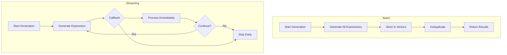
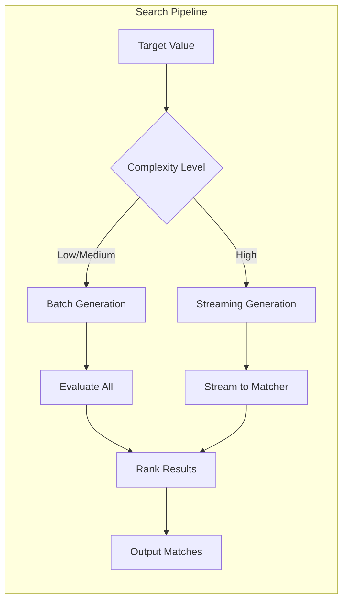
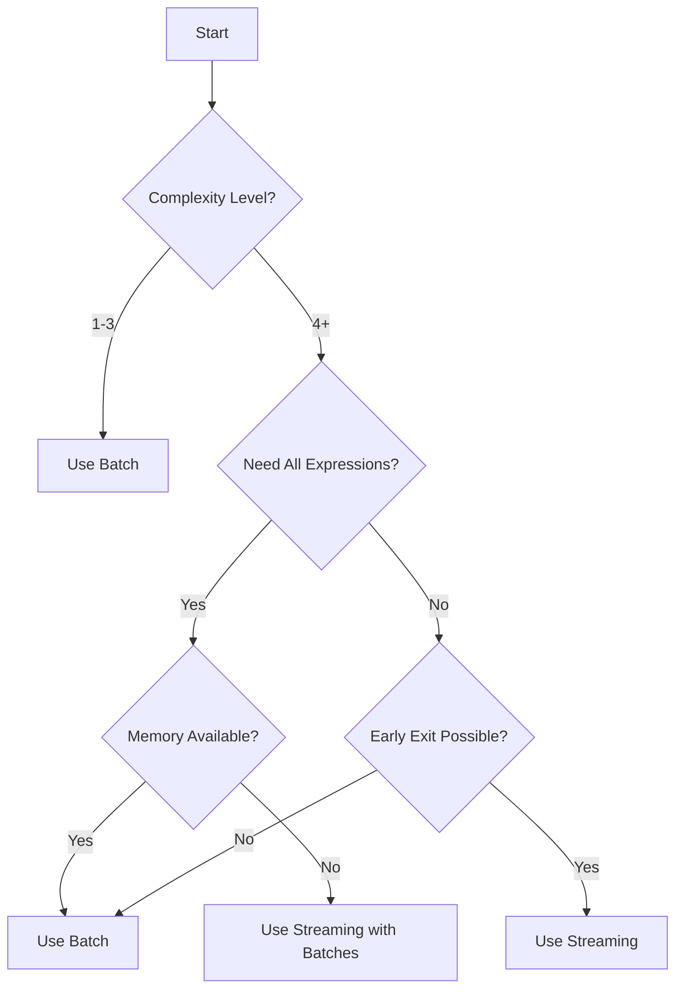

# RIES-RS Architecture Documentation

This document describes the architectural decisions and patterns used in ries-rs.

## Expression Generation: Streaming vs Batch

The expression generation system in [`src/gen.rs`](../src/gen.rs) supports two approaches for
enumerating mathematical expressions: **batch** and **streaming**. Each has distinct
memory and performance characteristics that make it suitable for different scenarios.

### Overview

RIES generates candidate expressions by recursively building postfix notation sequences.
At higher complexity levels, the number of possible expressions grows exponentially,
making memory management critical.



### Batch Generation

**Entry Point**: [`generate_all()`](../src/gen.rs:152)

Batch generation collects all valid expressions into memory before returning them.

```rust,ignore
pub fn generate_all(config: &GenConfig, target: f64) -> GeneratedExprs {
    let mut lhs_raw = Vec::new();
    let mut rhs_raw = Vec::new();
    
    generate_recursive(config, target, &mut Expression::new(), 0, &mut lhs_raw, &mut rhs_raw);
    
    // Deduplicate and return
    GeneratedExprs { lhs: lhs_map.into_values().collect(), rhs: rhs_map.into_values().collect() }
}
```

**Characteristics**:

| Property | Value |
|----------|-------|
| Memory Usage | O(n) where n = number of expressions |
| Deduplication | Built-in, automatic |
| Early Exit | Not supported |
| API Simplicity | High - single return value |

**When to Use**:
- Low to medium complexity levels (typically `-l1` to `-l3`)
- When all expressions are needed for post-processing
- When simplicity of API is preferred
- Single-threaded contexts

### Streaming Generation

**Entry Point**: [`generate_streaming()`](../src/gen.rs:266)

Streaming generation processes expressions via callbacks as they are generated,
eliminating the need to store all expressions simultaneously.

```rust,ignore
pub struct StreamingCallbacks<'a> {
    pub on_rhs: &'a mut dyn FnMut(&EvaluatedExpr) -> bool,
    pub on_lhs: &'a mut dyn FnMut(&EvaluatedExpr) -> bool,
}

pub fn generate_streaming(config: &GenConfig, target: f64, callbacks: &mut StreamingCallbacks) {
    generate_recursive_streaming(config, target, &mut Expression::new(), 0, callbacks);
}
```

**Characteristics**:

| Property | Value |
|----------|-------|
| Memory Usage | O(d) where d = maximum expression depth |
| Deduplication | Caller responsibility |
| Early Exit | Supported via callback return value |
| API Simplicity | Moderate - requires callback setup |

**When to Use**:
- High complexity levels (`-l4` and above)
- Memory-constrained environments
- When early termination is desired (e.g., found exact match)
- Parallel processing pipelines

### Memory Characteristics

The memory difference between approaches is substantial at higher complexity levels:

```
Complexity Level  |  Approx Expressions  |  Batch Memory  |  Streaming Memory
------------------|----------------------|----------------|-------------------
-l1               |  ~10,000             |  ~2 MB         |  ~1 KB
-l2               |  ~100,000            |  ~20 MB        |  ~1 KB
-l3               |  ~1,000,000          |  ~200 MB       |  ~1 KB
-l4               |  ~10,000,000         |  ~2 GB         |  ~1 KB
-l5               |  ~100,000,000        |  ~20 GB        |  ~1 KB
```

**Note**: Streaming memory is constant because it only stores:
- The current expression being built (typically < 20 symbols)
- The recursion call stack (depth limited by expression length)

### Performance Implications

#### Throughput

Both approaches have similar generation throughput since the underlying
[`generate_recursive()`](../src/gen.rs:500) and [`generate_recursive_streaming()`](../src/gen.rs:328)
functions perform the same operations. The difference lies in what happens after generation:

| Operation | Batch | Streaming |
|-----------|-------|-----------|
| Generate expression | Same | Same |
| Store expression | Vec::push | Callback call |
| Deduplication | Post-process all | Per-batch or incremental |
| Memory allocation | Multiple reallocations | None after initial setup |

#### Early Exit Advantage

Streaming can terminate early when a satisfactory result is found:

```rust,ignore
let mut found_exact = false;
let callbacks = StreamingCallbacks {
    on_rhs: &mut |expr| {
        if (expr.value - target).abs() < 1e-10 {
            found_exact = true;
            return false; // Stop generation
        }
        true
    },
    on_lhs: &mut |_| true,
};
generate_streaming(&config, target, &mut callbacks);
```

This can save significant time when good matches are found early in the generation process.

### Impact on Search Pipeline

The search pipeline in [`src/search.rs`](../src/search.rs) uses both approaches:

1. **Initial Search**: Uses batch generation for simplicity
2. **Deep Search**: May use streaming for memory efficiency
3. **Parallel Search**: Uses batch generation per thread, then merges results



### Implementation Details

#### Core Generation Functions

Both approaches share the same recursive structure:

1. **Base Case**: When `stack_depth == 1`, a complete expression is ready
2. **Recursive Case**: Try adding each valid symbol (constants, unary ops, binary ops)
3. **Pruning**: Skip expressions that are mathematically redundant

The key difference is what happens at the base case:

**Batch** ([`generate_recursive()`](../src/gen.rs:500)):
```rust,ignore
if stack_depth == 1 && !current.is_empty() {
    lhs_out.push(eval_expr);  // or rhs_out.push()
}
```

**Streaming** ([`generate_recursive_streaming()`](../src/gen.rs:328)):
```rust,ignore
if stack_depth == 1 && !current.is_empty() {
    if !(callbacks.on_lhs)(&eval_expr) {
        return false;  // Early exit signaled
    }
}
```

#### Deduplication Strategy

Batch generation includes built-in deduplication using hash maps:

```rust,ignore
// RHS: deduplicate by quantized value
let mut rhs_map: HashMap<i64, EvaluatedExpr> = HashMap::new();

// LHS: deduplicate by (value, derivative) pair
let mut lhs_map: HashMap<LhsKey, EvaluatedExpr> = HashMap::new();
```

Streaming delegates deduplication to the caller, enabling:
- Per-batch deduplication for memory efficiency
- Skip deduplication when not needed
- Custom deduplication strategies

### Guidelines for Choosing

Use this decision tree to select the appropriate approach:



### Related Documentation

- [`PERFORMANCE.md`](PERFORMANCE.md) - Benchmarking and optimization guidance
- [`COMPLEXITY.md`](COMPLEXITY.md) - Symbol weight model and ranking rationale
